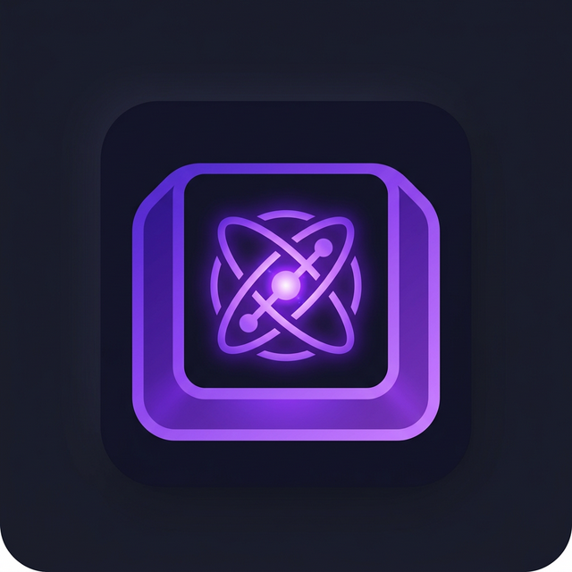

<div align="center">



# KeyNexus

**Cada teclado com o seu layout — automático, silencioso e instantâneo.**

[](https://microsoft.com/windows)
[](https://dotnet.microsoft.com/)
[]()
[]()

<br />

KeyNexus identifica em tempo real qual teclado físico você está usando e alterna o layout do Windows imediatamente.  
Chega de alternar manualmente com `Win + Espaço` ao trocar entre um teclado **ABNT2** e um **US International**.

</div>

<hr />

## Destaques

| Recurso | Descrição |
| :--- | :--- |
| **Alternância Automática** | Detecta o periférico ativo no primeiro toque e ajusta o layout correspondente no Windows sem atraso. |
| **Teclas Personalizadas** | Crie regras por teclado: remapeie teclas individuais, envie textos prontos ou execute sequências de macros com atrasos. |
| **Modificadores Suportados** | Suporte a combinações com `Ctrl`, `Alt`, `Shift`, `Win` e `AltGr`. |
| **Memória de Dispositivos** | Guarda layouts, nomes amigáveis e apelidos mesmo se o teclado for desconectado da porta USB. |
| **Bandeja do Sistema** | Roda minimizado de forma leve, com atalho para soltar teclas presas, pausar o monitoramento e acessar logs. |
| **Diagnóstico HID e Raw Input** | Janela dedicada para inspecionar VID, PID, caminho de dispositivo e propriedades de hardware. |

<br />

## Como funciona

```text
[ Teclado A (ABNT2) ]  ────────┐
                               ├─► [ KeyNexus (Raw Input Hook) ] ─► [ Windows: Layout ABNT2 ]
[ Teclado B (US-Intl) ] ───────┘                                 ─► [ Windows: Layout US ]
```

1. **Pressione qualquer tecla** em um dos seus teclados conectados.
2. O KeyNexus detecta a identificação de hardware e destaca o teclado na interface.
3. **Selecione o layout desejado** uma única vez na lista do sistema.
4. Pronto. Ao alternar entre os teclados, o sistema operacional acompanha o dispositivo em foco.

<br />

## Requisitos de Sistema

- **Sistema Operacional:** Windows 10 ou Windows 11 (64-bit)
- **Para compilar o código:** [.NET SDK 10.0](https://dotnet.microsoft.com/download)

<br />

## Compilação e Execução

Clone o repositório em sua máquina:

```powershell
git clone https://github.com/GabrielJGGS/KeyNexus.git
cd KeyNexus
```

### Executar em modo de desenvolvimento

```powershell
dotnet run --project KeyNexus.csproj
```

### Gerar executável único autônomo (Single-File)

Para gerar um binário independente que funciona diretamente sem depender do runtime do .NET instalado:

```powershell
dotnet publish -c Release
```

> **Localização do executável:**  
> O arquivo autônomo é gerado em:  
> `bin\Release\net10.0-windows\win-x64\publish\KeyNexus.exe`  
> *(Copie apenas este arquivo da pasta `publish` para onde preferir).*

<br />

## Testes Automatizados

O projeto inclui suíte de testes de unidade para validação de hooks, identificadores de dispositivo, compilador de perfis e catálogo de layouts:

```powershell
dotnet test KeyNexus.Tests
```

<br />

## Armazenamento de Configurações

Todas as preferências do usuário, mapeamentos e registros de depuração são salvos localmente em:

```text
%AppData%\KeyNexus\
├── keynexus_config.json   # Regras de layout, apelidos e remapeamentos
└── keynexus.log           # Registros de eventos para suporte e diagnóstico
```

<br />

## Arquitetura do Repositório

```text
KeyNexus/
├── Assets/             # Recursos visuais (ícones da aplicação e bandeja)
├── Core/               # Núcleo de gerenciamento, configuração e logging
│   ├── Input/          # Captura Raw Input, Hooks de teclado e envio de eventos
│   └── Profiles/       # Compilador de perfis otimizado para o hook em tempo real
├── Themes/             # Paleta de cores (Colors.xaml) e controles WPF (Controls.xaml)
├── ViewModels/         # Camada de apresentação MVVM
├── KeyNexus.Tests/     # Testes de regressão e unidade
├── MainWindow.xaml     # Tela principal e gerenciamento dos dispositivos
├── RemapEditorWindow.xaml # Editor visual de macros e remapeamento
└── DeviceInfoWindow.xaml  # Painel de diagnóstico técnico HID
```

<br />

## Personalização Visual

O visual do KeyNexus utiliza temas WPF isolados em arquivos XAML dedicados:
- **`Themes/Colors.xaml`**: Paleta de cores, acentos, fundos e tons secundários.
- **`Themes/Controls.xaml`**: Estilização de botões, cards, alternadores e campos de texto.

<br />

## Versão Open Source

Esta versão disponibilizada no repositório público é 100% autônoma e offline. Ela não realiza telemetria, não consulta servidores externos e não possui rotinas de atualização automática.
